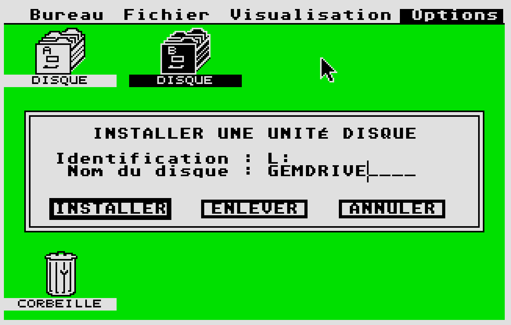

# ACSI2STM-Quick-Start-Guide

This document explains the steps to get the recommended hardware and software as quickly and as simply as possible. 

Base on the original  to the ACSI2STM GitHub https://github.com/retro16/acsi2stm 

Installing the PCB
### 1 - Backup battery
Before installing, insert a CR2032 battery in the socket. The battery is only needed for keeping the clock running when the ST is off.
See this video on how to insert the battery: https://youtu.be/rgAsQ0IYjlg

### 2 - Installing on the DB19 port
* Plug the unit on the back of the ST, components toward the keyboard.  The mounting holes of the Hard Disk socket should be aligned.
* Put some screws to hold the unit in place (optional).  If you need screws, you can unscrew the hex screws of the Modem or Printer socket.
* Power the unit via the USB-C port.
* Optionally, you can plug other devices such as an UltraSatan on the IDC20  socket.

### 3A - Using microSD card formated in FAT32 in GemDrive mode
Using Fat and Fat32 microSD cards without any other action is known as “GemDrive” mode. This is the easiest way to use the card. It does not require any driver. The microSD card will be usable on a Windows PC (to transfer files to your Atari for example).
This mode has been tested and known to be working well on Atari ST, STE, Mega ST and Mega STE with TOS equal or above 1.04
That mode has not been tested on Atari TT030 and Falcon030. The TOS on these machines may not work in GemDrive mode.
 
#### 3A.1 - Setting date and time
In GemDrive mode, you can use any tool to set the date, such as `CONTROL.ACC` or `XCONTROL.ACC`. GemDrive redirects all system calls to the STM32 so the internal clock isn't used anymore.

### 3B ACSI mode - Using microSD card ACSI mode

Use a ready-made ACSI disk image If you have a bootable hard disk image, the following sections will describe how to use it.

#### 3B.1 - Transfering a disk image to a raw SD card

Using a raw SD card is a bit faster than copying the image file.

To transfer images to the disk, you can use [Raspberry Pi Imager](https://www.raspberrypi.com/software/) :

* Open Raspberry Pi Imager.
* Click Choose Os under Operating System.
* Select Use custom in the list.
* Select the image file you wish to transfer.
* Under Storage, click Choose storage.
* Select the SD card you want to write to.
* Click Write to start writing. Existing data on the SD card will be erased. Click Yes to confirm.
* The SD card can now be used on the ST.

Use a ready-made ACSI disk image.
If you have a bootable hard disk image, the following sections will describe how to use it.
These hard disk images are the same using by the HATARI emulator on PC and similar to the one used by UltraSatan.
They are also hard dick images preloaded with games and application available on the internet you can use the same way.
For copyright reasons, I only supply empty, ready to use images on this page.

#### 3B.2 - Using the image directly

Use a SD card formatted for PC (FAT32/ExFAT).
* Create a folder named acsi2stm at the root of the SD card.
* Copy your image inside that folder.
* Rename your image hd0.img.
* Insert the SD card in the ACSI2STM unit.
* Turn everything on.
* Enjoy. The file format is the same used by the Hatari emulator. You can test your image in Hatari: go to the menu, click Hard disks, then click Browse on the first line (ACSI HD 0) then reboot the emulated ST. You can even use the image directly on the SD card by opening hd0.img from within Hatari !

When working with disk images, the SD card can be of any size, as long as it uses a standard filesystem (FAT, FAT32 or ExFAT). The ST only sees the content of the hd0.img file.

You can copy more than one disk image xxxxx.img on to the SD card, but only hd0.img will be used.
​
Here is the ICD655 Driver : [Here](https://www.16-32bit.eu/_files/archives/63ce4b_ccdfc6f34217437ea4086139b8463f0c.zip?dn=icdp655a.zip)
​
#### 3B.3 ACSI Images files:
* [Image ICD Demo 14Mb](https://www.16-32bit.eu/_files/archives/63ce4b_3082677628774ea6b7d22948327123b6.zip?dn=ICDPROD_BOOTABLE_14Mb.zip)
* [Image ICD 16Mb + 4x256Mb Compatible with TOS 1.02](https://www.16-32bit.eu/_files/archives/63ce4b_3082677628774ea6b7d22948327123b6.zip?dn=ICDPROD_BOOTABLE_14Mb.zip)
* [Image ICD 32Mb + 2x512Mb for TOS > 1.02](https://www.16-32bit.eu/_files/archives/63ce4b_b122616693ea48bc9eac5dcafcea65c9.zip?dn=ICDPRO_BOOTABLE_32MB_2x512MB_tos_higer_than_102_with_utils_v1_3.zip)
* [Image HDDriver Demo 640Mb](https://www.16-32bit.eu/_files/archives/63ce4b_890f1bd292f6427ea6aa3f919798ce90.zip?dn=HDDRIVER120_BOOTABLE_SCSI_640Kb.zip)
* [Image AHDI_BOOTABLE_16Mb_1x256Mb](https://www.16-32bit.eu/_files/archives/63ce4b_488643455a554d4296f8df1ea7175351.zip?dn=AHDI_BOOTABLE_16Mb_1x256Mb.zip)  ([AHDI Driver used](https://www.16-32bit.eu/_files/archives/63ce4b_d6d9fac01a0843d38af821cc3d2d7789.zip?dn=ahdi6061.zip))
* [Image ICD 8x512MB (4Go)](Disk_Images/4GoICD.7z)
* [Image ICD 14x512MB (8Go)](Disk_Images/8GoICD.7z)

#### 3B.4 - Setting date and time
In ACSI mode, ACSI2STM emulates an UltraSatan clock, so you can use UltraSatan tools such as US_SETCL.PRG and US_GETCL.PRG. GemDrive mode also responds to UltraSatan clock queries as a convenience. When the system is switched off, the STM32 clock is powered by the onboard CR2032 battery so it will keep time even when powered off.

#### 4 - Mixing GemDrive and ACSI mode

Yes, it is possible to mix both modes at the same time. This will allow you to copy files into a FAT32 microSD card from your PC, then mount it on your Atari along with a microSD card containing an ACSI image with your ACSI driver such as ICD. You will then be able to copy files between GemDrive and ACSI.

Here an example using ICD driver (one of my ICD disk image)

- On PC, download all the files you want and place them on a microSD card your formatted in FAT32.
The files and folders names cannot be longer than 8 characters.
Referrer to [3A.1 - FAT32 microSD card] section on how to use the GemDrive mode.
Insert that microSD card in the first slot of the ACSI2STM

- Follow section [3B] to create a microSD card with an ACSI. You can download one of my ICD image, change the partition settings if you want. This second microSD is your ACSI drive.
Insert this second microSD card in to the second slot of the ACSI2STM

 -Power the ACSI2STM and start your Atari.

The display at boot time will be a bit different. A message about the your GemDrive being allocated to letter L is displayed

This will allow any ACSI partitions to use letter C to K

Then your HD driver will be displayed and boot the ACSI part.

Now, on the desktop, select any drive and go to Options>>Install a disk unit. Type L as Identification. Then Install.

A new disk icon shows up. It is your GemDrive with all the files you put on it. you can now copy files across all drives.

 
#### Hardware compatibility

ACSI2STM was successfully tested on the following configurations:

* Atari 520 STF, TOS 1.04, GemDrive + ICD driver
* Atari 1040 STE, TOS 1.62, GemDrive + ICD driver
* Atari 1040 STE, TOS 1.62, GemDrive + PP driver
* Atari 1040 STE, TOS 2.06, GemDrive + ICD driver
* Atari 1040 STE, EmuTOS, integrated ACSI driver + GemDrive
* Atari TT030, ACSI mode (driver not specified)

GemDrive mode is currently tested on Atari ST and STE (no TT). It might work on the TT. If anybody owns this hardware and is interested, please open a GitHub issue. Testing is safe for the hardware, not for data.

TOS 1.02 is working with the ACSI2STM card only in ACSI Mode.
TOS >= 1.04 ("rainbow TOS") is strongly recommended because older TOS will leak a small amount of memory when a program stops. It may or may not have an impact depending on how you use the machine.
TOS replacements such as MultiTOS, MiNT or others are incompatible with GemDrive mode. Implementing multitasking in GemDrive is nearly impossible on such a small microcontroller.
ACSI2STM was successfully tested on the following configurations:

* Atari 520 STF, TOS 1.04, GemDrive + ICD driver
* Atari 1040 STE, TOS 1.62, GemDrive + ICD driver
* Atari1040 STE, TOS 1.62, GemDrive + PP driver
* Atari 1040 STE, TOS 2.06, GemDrive + ICD driver
* Atari 1040 STE, EmuTOS, integrated ACSI driver + GemDrive
* Atari TT030, ACSI mode (driver not specified)

#### More resources...

ACSI2STM Enclosure 3D Print STL files: [Here](https://github.com/githubuser-user-ai/ACSI2STM-Quick-Start-Guide/tree/Release/ACSI2STM%20Compact%20V3%203D%20Case%20Images)

ACSI2STM project current state [GitHub](https://github.com/retro16/acsi2stm/tree/5.0)

* Atari ST pages by PP:  https://atari.8bitchip.info/
* Disk Image with ICD driver: http://joo.kie.sk/?page_id=332
* How to launch ST disk images (Games) from the HD: https://atari.8bitchip.info/imgrun.php
* Here a HD image with 196 games: https://atari.8bitchip.info/DiskImgPP1.html
* Atari Wiki Pages: https://www.atari-wiki.com/  

#### Q/A and Trouble shouting

What about Atari STE with "Bad DMA". Is it working on them?
Early Atari STE from 1989 and 1990 may has DMA issue. The"bad DMA" debate is still going on. On the Atari STE, the DMA port wiring is different from STF. Electronic has been added. ATARI found some issues with these changes and later replaced the original "C025913-38" DMA chip with a new chip "C398739-001"
The ACSI2STM should work with both DMA chip.
But in some case, Atari STE fitted with the "C025913-38" DMA chip may get corruptions after running for a while. It seems changing the capacitor on the motherboard solve this issue.
More about the DMA issue here: https://exxosforum.co.uk/atari/last/DMAfix/

A software fix was found after some investigation : https://www.chzsoft.de/site/hardware/new-atari-ste-bad-dma-investigation/

A software solution is possible, and was implemented in Gemdrive driver of ACSI2STM.

Other drivers (ICD, HDDrive, PP...) may follow.
